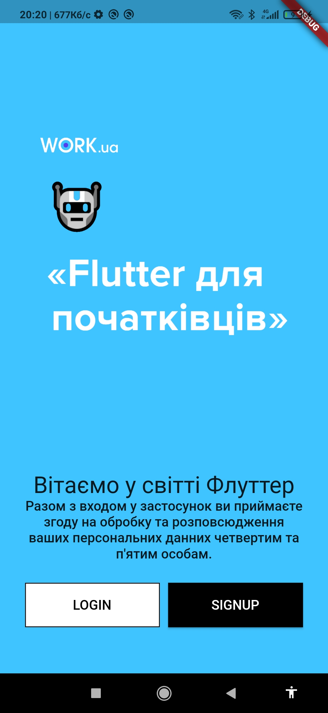
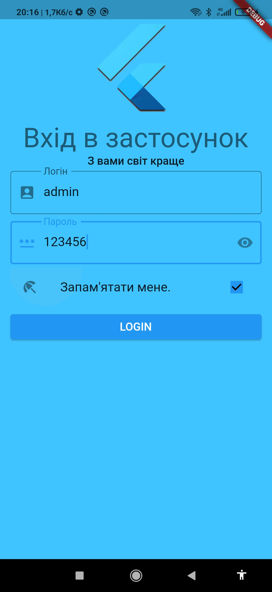
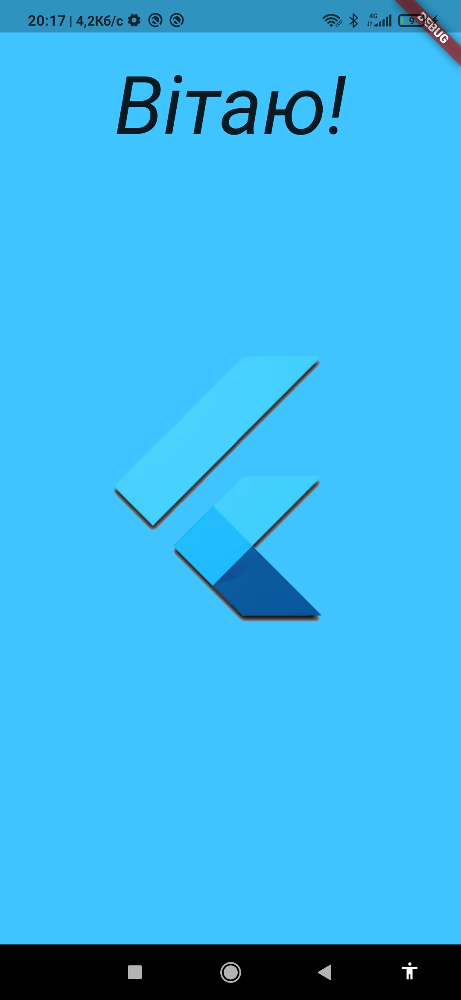

# flutter_splash_screen_22october_v3

Даний застосунок має функціонал:

Показує splash екран із зображенням на весь екран впродовж 3 секунд.  
Показує екран для вибору входу чи реєстрації. 
Якщо вибирати вхід то показує єкран з полями для вводу "login", "password", галочкою "запамʼятати" та кнопкою "далі".  
Якщо login = "admin" та password = "123456" то показає наступний екран з текстом "Вітаю!".  
Якщо логін та пароль неправильні показає юзеру повідомлення про це.  
Якщо логін був правильний та стояла галочка "запамʼятати" то наступного разу після splash одразу відкриває екран "Вітаю!"  

Тестовий проект, перевірка роботи та можливостей віджетів за допомогою Flutter.
 

  
  

 

  
  

