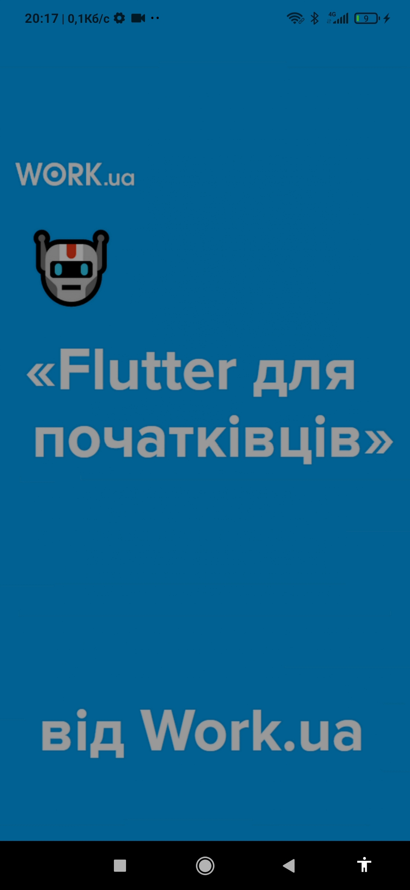

# flutter_splash_screen_22october_v3

This application has the following functionality:

Shows a full-screen splash screen for 3 seconds.
Shows a screen to select login or register.
If you choose login, it shows a screen with input fields "login", "password", a "remember" checkmark and a "next" button.
If login = "admin" and password = "123456" then the following screen with the text "Congratulations!" will be displayed.
If the login and password are incorrect, a message about this will be shown to the user.
If the login was correct and the "remember" checkmark was checked, the next time after the splash, the "Congratulations!" screen immediately opens.

Test project, checking the functionality and capabilities of widgets using Flutter.

Даний застосунок має функціонал:

Показує splash екран із зображенням на весь екран впродовж 3 секунд.  
Показує екран для вибору входу чи реєстрації. 
Якщо вибирати вхід то показує єкран з полями для вводу "login", "password", галочкою "запамʼятати" та кнопкою "далі".  
Якщо login = "admin" та password = "123456" то показає наступний екран з текстом "Вітаю!".  
Якщо логін та пароль неправильні показає юзеру повідомлення про це.  
Якщо логін був правильний та стояла галочка "запамʼятати" то наступного разу після splash одразу відкриває екран "Вітаю!"  

Тестовий проект, перевірка роботи та можливостей віджетів за допомогою Flutter.
 

  
  

 

  
  

